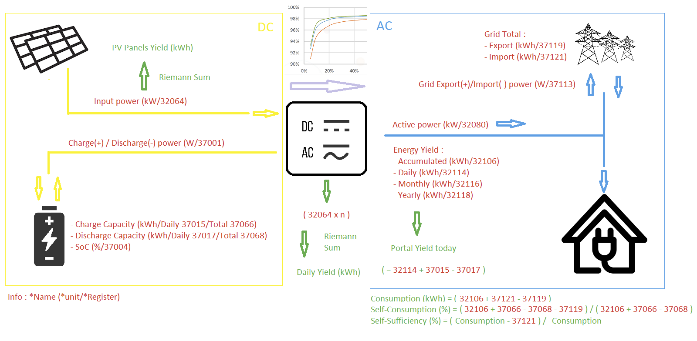
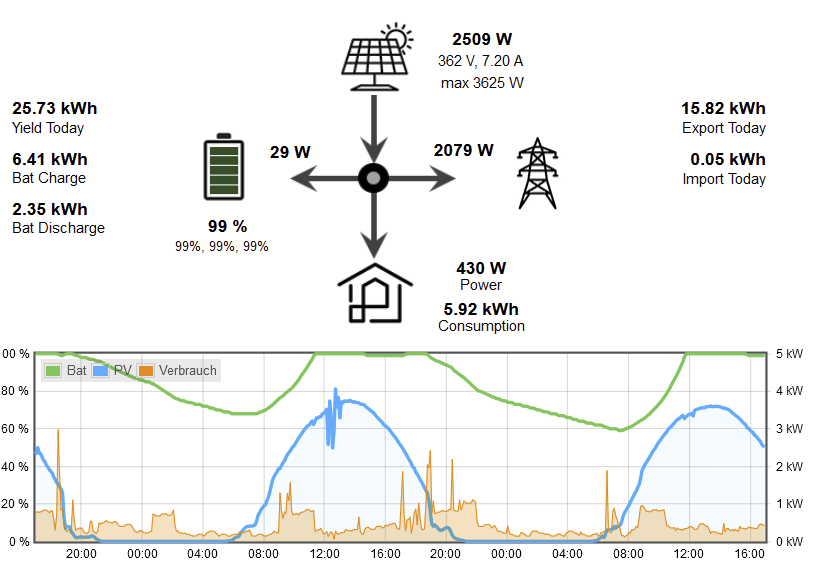

# SunLuna2000_iobroker
 Javascript support for Huawei Sun & Luna 2000 in iobroker.

## Introduction
The development of this script started in the iobroker Forum "Huawei Sun2000 & ioBroker via JS script funktioniert", see https://forum.iobroker.net/topic/53005/huawei-sun2000-iobroker-via-js-script-funktioniert

The script was started by Kachel; modified, corrected, extended and finally published on Github by Chris_B.

## Unsolved Issues
The most important unsolved issue is that the Daily yield does not take into account two things:
1) Battery charge from the grid. This happens when the solar panels cannot load due to weather / season.
2) Inverter loss.
3) Reconnect if Modbus connection fails: This is commented out in the script at the moment. You can uncomment the four lines (search for 'if (err.modbusCode == null)'). Let me know if it works for you.

I try to find solutions, but any input is welcome.

## Computations
The computations implemented are described by this diagram (that I found somewhere on the web):

Remarks:
- Sometimes variables computed seem to be a bit 'off'. This is most probably caused by the fact that the values below are not sampled at precisely the same time. When values change rapidly this can lead to these 'strange' values.

## Example Vis
The following picture shows an example Vis that shows the energy flow between the different components. In the lower part a flot diagram shows battery charge, power production and consumption during the last 48 hours

The following variables are used in the Vis display:

- Yield Today: javascript.0.Solarpower.Derived.YieldToday (see issue described above)
- Bat Charge: javascript.0.Solarpower.Huawei.Inverter.1.Batterystack.1.CurrentDayChargeCapacity
- Bat Discharge: javascript.0.Solarpower.Huawei.Inverter.1.Batterystack.1.CurrentDayDischargeCapacity
- Battery Percent: javascript.0.Solarpower.Huawei.Inverter.1.Battery.SOC, darunter javascript.0.Solarpower.Derived.BatteryOverview
- Solar panel, actual power **(NEW)**: javascript.0.Solarpower.Derived.PanelPower (this is now the raw panel power, i.e., voltage times current of panel)
- Solar panel voltage and current: javascript.0.Solarpower.Huawei.Inverter.1.String.1_Voltage, javascript.0.Solarpower.Huawei.Inverter.1.String.1_Current
- Power to and from battery **(NEW)**: javascript.0.Solarpower.Derived.BatteryCharge (now takes into account when inverter is in standby mode)
- Direction of arrow at battery: javascript.0.Solarpower.Derived.IsBatteryLoading (arrow is directed left or right)
- Power to and from grid: javascript.0.Solarpower.Huawei.Meter.ActivePower
- Direction of grid arrow: javascript.0.Solarpower.Derived.IsGridExporting
- Power consumption house: javascript.0.Solarpower.Derived.HouseConsumption
- Daily power consumption of house: javascript.0.Solarpower.Derived.ConsumptionToday
- Power Export Today: javascript.0.Solarpower.Derived.GridExportToday
- Import Today: javascript.0.Solarpower.Derived.GridImportToday

The following additional variables are available for output. Most of the variables contain text strings that translate the codes used in the Modbus registers:

- Device Status: javascript.0.Solarpower.Derived.DeviceStatus (e.g 'On-grid', 'Standby: detecting irradiation')
- Charge from grid: javascript.0.Solarpower.Derived.ChargeFromGrid (enable or disable)
- Battery Working Mode: javascript.0.Solarpower.Derived.WorkingMode (e.g. 'Maximise Self Consumption')
- Battery Stack Status: javascript.0.Solarpower.Derived.BatteryStackStatus (e.g. 'running', 'sleep mode')
- Battery Status: javascript.0.Solarpower.Derived.BatteryStatus (a string with the status of each battery)
- Inverter Temperature: javascript.0.Solarpower.Derived.InverterTemperature (temperature or '-' if in standby)
- Battery Temperature: javascript.0.Solarpower.Derived.BatteryTemperature (temperature or '-' if in standby)
- Grid Frequency: javascript.0.Solarpower.Derived.GridFrequency (frequency of the grid or '-' if in standby)

The battery symbol is a png with a bar graph in the back.

## Information logging
The following information is logged every day one minute before midnight:
1) Current Date
2) Derived.YieldToday
3) Derived.GridExportToday
4) Derived.GridImportToday
5) Derived.ConsumptionToday

This information is appended the the file opt/iobroker/iobroker-data/SolarpowerLog.csv. This file can be used to derive statistics.